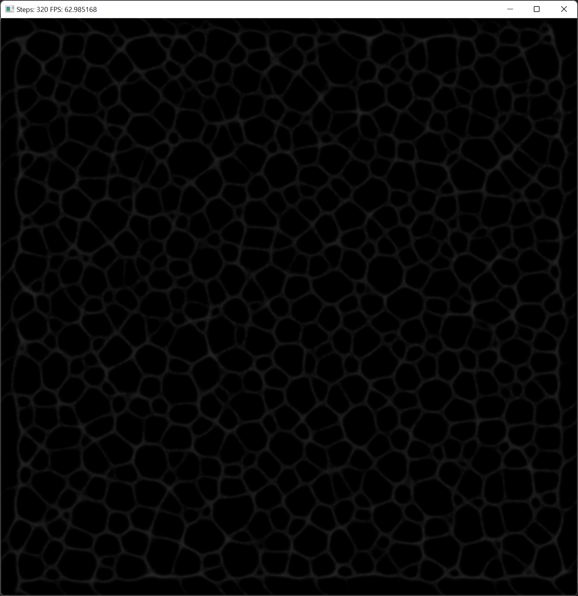

<!-- ABOUT THE PROJECT -->
## About The Project

This project is based on [this](https://uwe-repository.worktribe.com/output/980579) paper. The idea is to simulate slime mold based on a number of agents.



<!-- GETTING STARTED -->
## Getting Started

A solution file for Visual Studio 2022 is included in the repo.

### Prerequisites

This project is built using the following libraries:

* OpenCL 2.2
* OpenCV 4.5.5
* boost-compute 1.79

Make sure these libraries, with versions later or equal to mentioned above. Here's an example using ```vcpkg```

  ```sh
  vcpkg install opencl opencv4 boost-compute
  ```

### Installation

```sh
git clone https://github.com/andvra/slimemold.git
```

### Configuration (optional)

Many parameters mentioned in the original paper can be adjusted using the ```RunConfiguration``` class in ```slimemold.h```.

<p align="right">(<a href="#top">back to top</a>)</p>